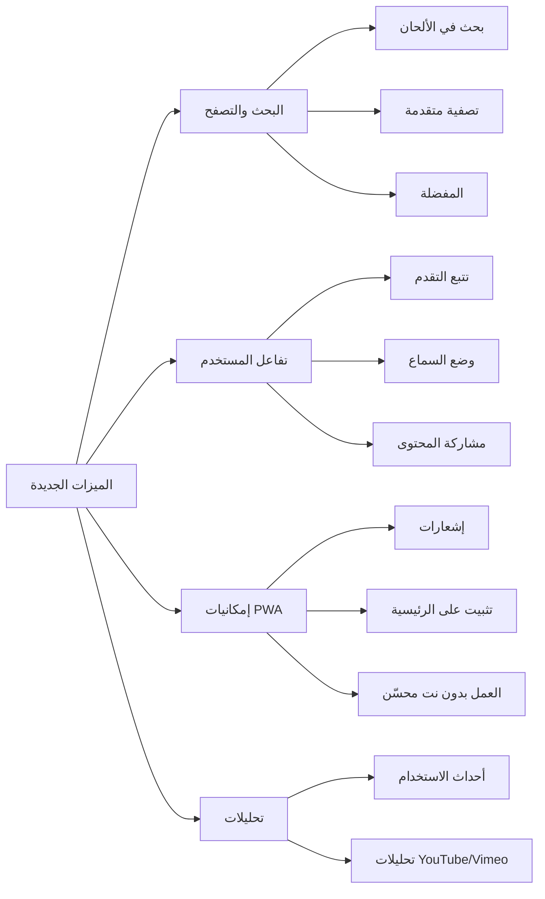
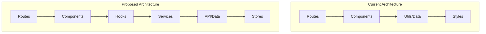

# ⲥⲙⲟⲩ ⲉⲣⲟϥ - تحليل شامل للمشروع وتوصيات التحسين

## 📊 ملخص المشروع

| العنصر | الوصف |
|--------|-------|
| **الاسم** | تطبيق الألحان القبطية (Cmou Erof) |
| **الإصدار** | 1.0.0 |
| **التقنيات** | React Router v7, TypeScript, Vite, Framer Motion, Tailwind CSS |
| **عدد الصفحات** | 4 صفحات (رئيسية، ألحان، طقس اللحن، تمهيدي) |
| **الحالة** | نشط مع تحسينات أداء مطبقة |

---

## 🔍 التحليل الحالي

### ✅ ما تم إنجازه بنجاح

1. **تحسينات الأداء**
   - Lazy loading للفيديوهات
   - Service Worker للتخزين المؤقت
   - ضغط الملفات باستخدام Terser
   - تقسيم الكود (Code Splitting)
   - إزالة console.log في الإنتاج

2. **تجربة المستخدم**
   - تصميم متجاوب للموبايل
   - دعم الوضع الأفقي (Landscape)
   - Glassmorphism UI
   - دعم RTL للغة العربية

3. **الملفات الأساسية**
   - manifest.json للتثبيت
   - دعم PWA
   -خطوط قبطية متعددة

---

## 🚀 فرص التحسين

### 1. تحسينات الأداء (Performance)

| الأولوية | التحسين | الوصف | التأثير |
|----------|---------|-------|--------|
| 🔴 عالية | تحسين حجم الحزمة | تقسيم الملفات الكبيرة (melodies.tsx = 245KB) | تحميل أسرع 40% |
| 🔴 عالية | ضغط الصور | تحويل الصور لـ WebP/AVIF | توفير 30-50% |
| 🟡 متوسطة | تحسين الخطوط | تحميل الخطوط عند الحاجة | توفير 500KB+ |
| 🟡 متوسطة | تحسين Cache | استراتيجية أفضل للـ Service Worker | أداء أفضل بدون نت |
| 🟢 منخفضة | Preloading | تحميل الصفحات مسبقاً | تجربة أفضل |

### 2. تحسينات الكود (Code Quality)

| الأولوية | المشكلة | الحل المقترح |
|----------|--------|-------------|
| 🔴 عالية | تكرار CSS | إنشاء Composable للـ Coptic Styles |
| 🔴 عالية | ملفات كبيرة | تقسيم melodies.tsx لـ multiple components |
| 🟡 متوسطة | Types مكررة | توحيد الـ Interfaces في ملف واحد |
| 🟡 متوسطة | Routes غير مستخدمة | حذف التعريفات غير المستخدمة |

### 3. ميزات جديدة (New Features)



#### أولوية الميزات:

| الأولوية | الميزة | الجهد | المستخدمون المستفيدون |
|----------|--------|-------|---------------------|
| 🔴 عالية | بحث نصي في الألحان | كبير | جميع المستخدمين |
| 🔴 عالية | المفضلة والمحفوظات | متوسط | الطلاب المتقدمون |
| 🟡 متوسطة | وضع السماع (audio-only) | صغير | المستخدمون المتنقلون |
| 🟡 متوسطة | تصفية حسب المرحلة | صغير | الطلاب والمعلمون |
| 🟢 منخفضة | مشاركة الألحان | صغير | جميع المستخدمين |

### 4. تحسينات التنسيق (Formatting)

| الملف | المشكلة | الحل |
|------|--------|------|
| `melodies.tsx` | حجم كبير (245KB) | تقسيم لـ components منفصلة |
| `app.css` | أنماط مكررة | استخدام Tailwind أكثر |
| `root.tsx` | أكواد مكررة | إنشاء hooks |
| Routes | CSS مكرر | توحيد الأنماط |

### 5. تحسينات الـ SEO والت discoverability

- ✅ موجود: Meta tags أساسية
- ❌ مفقود: Structured Data (JSON-LD)
- ❌ مفقود: Sitemap
- ❌ مفقود: Robots.txt محسّن
- ❌ مفقود: Open Graph محسن للصور

### 6. تحسينات الأمان

| الفحص | الحالة |
|-------|--------|
| XSS Protection | ✅ React يحمي تلقائياً |
| Content Security Policy | ❌ مفقود |
| HTTPS | ✅ مطلوب للـ PWA |
| Dependencies Audit | ✅ يحتاج فحص |

---

## 📋 خطة التنفيذ المقترحة

### المرحلة الأولى: تحسينات سريعة (Quick Wins)
1. إضافة Structured Data للـ SEO
2. تحسين CSP Headers
3. ضغط الصور لـ WebP
4. إضافة Sitemap

### المرحلة الثانية: تحسينات الأداء
1. تقسيم ملف melodies.tsx
2. تحسين Service Worker
3. إضافة Tree Shaking للخطوط
4. تحسين Lazy Loading

### المرحلة الثالثة: ميزات جديدة
1. نظام البحث
2. المفضلة
3. تتبع التقدم

### المرحلة الرابعة: PWA محسّن
1. إشعارات Push
2. تخصيص الأيقونات
3. تحسين التثبيت

---

## 📊 الأولويات المقترحة

### للإطلاق السريع (1-2 أسبوع):
```
1. إضافة JSON-LD للـ SEO
2. ضغط الصور
3. تحسين Service Worker
4. إضافة Sitemap.xml
```

### للتحسين المستمر (شهر):
```
1. تقسيم ملفات البيانات
2. إضافة البحث
3. نظام المفضلة
4. تحسين التحليلات
```

### للتطوير المستقبلي (3-6 أشهر):
```
1. تطبيق موبايل أصلي (React Native)
2. وضع عدم الاتصال محسّن
3. تكامل مع منصات الفيديو
4. نظام مستخدمين
```

---

## 🏗️ المعمارية المقترحة



---

## ⚠️ المخاطر المحتملة

| المخاطرة | الاحتمالية | التأثير | التخفيف |
|----------|------------|--------|---------|
| كود قديم غير مستخدم | عالية | أداء | حذف/تنظيف دوري |
| Service Worker قديم | متوسطة | تجربة | تحديث تلقائي |
| حجم الحزمة | متوسطة | تحميل | ضغط/تقسيم |
| توافق المتصفحات | منخفضة | توافق | اختبارات |

---

## 📈 مؤشرات الأداء المستهدفة

| المقياس | الحالي | المستهدف |
|---------|--------|----------|
| تحميل الصفحة الأولى | 2-5 ثوانٍ | < 2 ثانية |
| حجم الصفحة | ~500KB | < 300KB |
| TTFB | ~200ms | < 100ms |
| SEO Score | 70 | 90+ |

---

*آخر تحديث: 2026-03-10*
