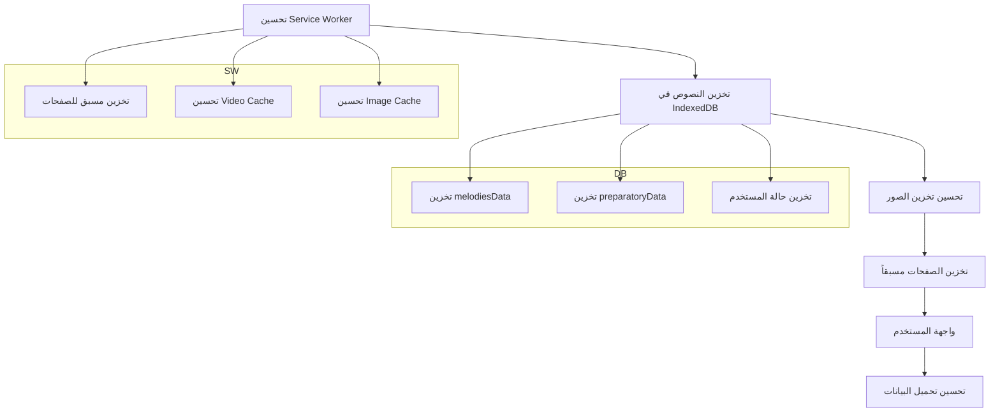

# خطة تحسين التخزين للعمل بدون إنترنت (Offline-First)

## نظرة عامة

هذا المستند يوضح خطة شاملة لتحويل التطبيق للعمل بدون إنترنت، مع التركيز على:
1. تخزين النصوص والبيانات محلياً
2. تخزين الصور والفيديوهات بشكل فعال
3. تحسين سرعة التحميل والأداء

---

## الحالة الحالية

### ما يعمل حالياً:
- ✅ Service Worker موجود مع استراتيجيات تخزين مؤقت
- ✅ تخزين الفيديوهات في Cache API عند التشغيل
- ✅ تخزين الصور المحلية (في `/public/photos/`)
- ✅ تخزين الخطوط (Google Fonts)
- ✅ PWA manifest مع دعم offline

### ما يحتاج تحسين:
- ❌ البيانات القبطية (melodiesData, preparatoryData) تُحمّل من Supabase
- ❌ صور الهزات من Supabase غير مخزنة بشكل كافٍ
- ❌ الصفحات تُحمّل ديناميكياً بدون تخزين مسبق
- ❌ لا يوجد تحكم للمستخدم في تخزين الفيديوهات

---

## الخطة التفصيلية

### 1. تحسين Service Worker للتخزين الشامل

**الملفات المطلوبة:**
- `public/sw.js` - التحديث الرئيسي

**التغييرات المطلوبة:**
```
1.1 إضافة تخزين مسبق للصفحات (Pre-caching)
    - تخزين جميع الـ Routes: /, /melodies, /about, /preparatory
    - استخدام Cache-First للصفحات الثابتة

1.2 تحسين تخزين الفيديوهات
    - زيادة حد التخزين إلى 2GB
    - إضافة دعم Range Requests للتخزين الصحيح
    - إضافة رسالة POSTMESSAGE للتخزين المسبق

1.3 تحسين تخزين الصور من Supabase
    - إضافة cache للصور من supabase.co
    - استخدام stale-while-revalidate
```

### 2. إضافة IndexedDB لتخزين البيانات (النصوص)

**الملفات المطلوبة:**
- `app/utils/offlineDB.ts` - جديد

**الوظائف المطلوبة:**
```typescript
// تخزين البيانات القبطية محلياً
- saveMelodiesData(data: VideoData): Promise<void>
- getMelodiesData(): Promise<VideoData | null>
- savePreparatoryData(data: PreparatoryItem[]): Promise<void>
- getPreparatoryData(): Promise<PreparatoryItem[] | null>

// تخزين حالة المستخدم
- saveUserProgress(stage: string, level: string, videoId: string, time: number): Promise<void>
- getUserProgress(): Promise<UserProgress>
```

### 3. تحسين تخزين الصور من Supabase

**الملفات المطلوبة:**
- `app/components/OptimizedImage.tsx` - موجود (تحسين)
- `public/sw.js` - تحديث

**التغييرات:**
```
3.1 إضافة استراتيجية للصور من Supabase
    - استخدام Cache-First
    - تخزين تلقائي عند أول تحميل

3.2 تحسين مكون OptimizedImage
    - إضافة تحميل متقدم (preload)
    - إضافة placeholders محسنة
```

### 4. تخزين مسبق للصفحات (Routes Pre-caching)

**الملفات المطلوبة:**
- `app/root.tsx` - تحديث
- `public/sw.js` - تحديث

**التغييرات:**
```
4.1 إضافة قائمة الصفحات للـ Pre-caching
    const PAGES_TO_PRECACHE = [
      '/',
      '/melodies',
      '/about',
      '/preparatory'
    ];

4.2 تحديث منطق التثبيت لتخزين جميع الصفحات
```

### 5. إضافة واجهة تحكم للمستخدم

**الملفات المطلوبة:**
- `app/components/OfflineManager.tsx` - جديد
- `app/root.tsx` - إضافة المكون

**الوظائف:**
```
5.1 عرض حالة التخزين
    - مساحة الفيديوهات المخزنة
    - مساحة الصور المخزنة
    - عدد الفيديوهات المتاحة offline

5.2 تحكم المستخدم
    - زر "تحميل كل الفيديوهات"
    - زر "مسح التخزين"
    - عرض تقدم التحميل

5.3 إشعار بدون نت
    - إظهار حالة الاتصال
    - إشعار عند العمل بدون نت
```

### 6. تحسين تحميل البيانات

**الملفات المطلوبة:**
- `app/routes/melodies.tsx` - تحديث
- `app/routes/preparatory.tsx` - تحديث

**التغييرات:**
```
6.1 تحميل البيانات
    - أولاً: جرب تحميل من IndexedDB
    - ثانياً: إذا لم تكن موجودة، حمل من Supabase
    - ثالثاً: احفظ في IndexedDB للاستخدام المستقبلي

6.2 معالجة الأخطاء
    - عرض البيانات المخزنة محلياً عند فشل الاتصال
    - إشعار المستخدم بحالة البيانات
```

---

## الأولوية والتسلسل



### الأولوية:
1. **الأول**: Service Worker (تحسين التخزين)
2. **الثاني**: IndexedDB (تخزين النصوص)
3. **الثالث**: واجهة المستخدم (تحكم المستخدم)

---

## التفاصيل التقنية

### التغييرات المطلوبة بالترتيب:

### الخطوة 1: تحسين Service Worker
- تحديث `public/sw.js`
- إضافة تخزين مسبق للصفحات عند التثبيت
- تحسين استراتيجيات التخزين لكل نوع ملف
- إضافة دعم رسائل POSTMESSAGE للتخزين المسبق

### الخطوة 2: إنشاء ملف IndexedDB
- إنشاء `app/utils/offlineDB.ts`
- تنفيذ وظائف تخزين البيانات القبطية
- تنفيذ وظائف تخزين حالة المستخدم

### الخطوة 3: تحسين تحميل البيانات
- تحديث `app/routes/melodies.tsx`
- تحديث `app/routes/preparatory.tsx`
- تحميل البيانات من IndexedDB أولاً ثم Supabase

### الخطوة 4: إضافة واجهة المستخدم
- إنشاء `app/components/OfflineManager.tsx`
- إضافة تحكم في التخزين للمستخدم
- عرض حالة العمل بدون نت

### الخطوة 5: تحسين مكون الصور
- تحديث `app/components/OptimizedImage.tsx` (موجود)
- إضافة تحميل متقدم للصور

---

## الملفات التي ستتم إضافتها/تعديلها:

### ملفات جديدة:
1. `app/utils/offlineDB.ts` - قاعدة بيانات IndexedDB
2. `app/components/OfflineManager.tsx` - واجهة تحكم المستخدم

### ملفات للتعديل:
1. `public/sw.js` - Service Worker محسّن
2. `app/root.tsx` - إضافة OfflineManager
3. `app/routes/melodies.tsx` - تحميل البيانات من IndexedDB
4. `app/routes/preparatory.tsx` - تحميل البيانات من IndexedDB

---

## ملخص ما سيحصل عليه المستخدم:

✅ **الفيديوهات**:
- تخزين تلقائي عند التشغيل
- تشغيل بدون نت بعد التخزين الأول
- تحكم المستخدم في التخزين (عرض/مسح)

✅ **الصور**:
- تخزين تلقائي من Supabase
- تحميل سريع من الذاكرة المؤقتة

✅ **النصوص والبيانات**:
- تخزين في IndexedDB
- تحميل بدون نت
- حفظ حالة المستخدم (موقع الفيديو)

✅ **الصفحات**:
- تخزين مسبق عند أول تشغيل
- فتح الصفحات بدون نت

✅ **خطوات التنفيذ**:
1. تحسين Service Worker
2. إنشاء IndexedDB
3. تحسين تحميل البيانات
4. إضافة واجهة المستخدم
5. تحسين الصور
